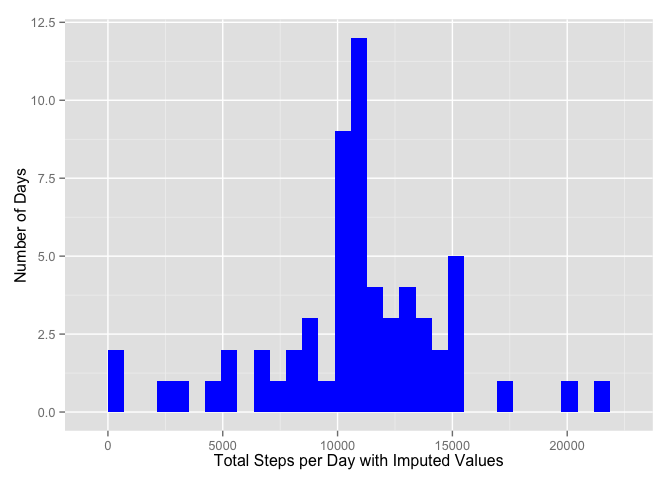

# Reproducible Research: Peer Assessment 1
## Initialization


```r
library(knitr)
library(dplyr, warn.conflicts = FALSE, quietly = TRUE)
library(ggplot2)
library(reshape2)
library(zoo, warn.conflicts = FALSE, quietly = TRUE)
setwd("~/OneDrive/Documents/0 SourceThought Private/Data Science Course/repo/RepData_PeerAssessment1")
```

## Loading and preprocessing the data

Adding date (posDate) amd dateTime.  
Converting interval to minutes to remove gaps from the 60 to 95 minute interval each hour.  
Removing NA to create activityNoNA dataframe


```r
unzip("activity.zip")
activity <- read.csv("activity.csv")
activity$posDate = as.POSIXct(activity$date)
activity$minutes = activity$interval %/% 100 * 60 + activity$interval %% 100
activity$dateTime = activity$posDate + activity$minutes * 60
stepNA <- is.na(activity$steps)
activityNoNA <- activity[!stepNA,]
```

## What is mean total number of steps taken per day?

Histogram of the total number of steps taken per day.  
Calculate mean and median of the total number of steps taken per day.  


```r
totalDaily <- sapply(split(activityNoNA$steps, activityNoNA$posDate, drop = TRUE), sum)
qplot(totalDaily, xlab = "Total Steps per Day", ylab = "Number of Days") + geom_histogram(fill = "red") + guides(fill=FALSE)
```

```
## stat_bin: binwidth defaulted to range/30. Use 'binwidth = x' to adjust this.
## stat_bin: binwidth defaulted to range/30. Use 'binwidth = x' to adjust this.
```

 

```r
mean(totalDaily)
```

```
## [1] 10766.19
```

```r
median(totalDaily)
```

```
## [1] 10765
```

## What is the average daily activity pattern? 

Graph shows average steps taken for each 5 minute time interval across entire study period.  
Used the time series object per the assignment.   Used minutes instead of interval to smooth gaps.


```r
par(mfrow=c(1,1))
stepMinutes <- aggregate(list(meanDailySteps = activityNoNA$steps), list(minutes = activityNoNA$minutes, 
                         interval = activityNoNA$interval), mean)
stepMinutes.ts <- as.ts(zooreg(stepMinutes$meanDailySteps, frequency = .2, order.by = stepMinutes$minutes))
plot(stepMinutes.ts, type="l", xlab = "Minute of the Day", ylab = "Number of Steps in 5 Minute Interval")
```

 

What is the time period of maximum activity.   Show interval, minutes into day and time of day.


```r
maxInterval <- stepMinutes$interval[which.max(stepMinutes$meanDailySteps)]
maxInterval
```

```
## [1] 835
```

```r
maxMinute <- time(stepMinutes.ts)[which.max(stepMinutes.ts)]
maxMinute
```

```
## [1] 515
```

```r
format(as.POSIXct('0001-01-01 00:00:00') + maxMinute * 60, "%I:%M:%S %p") 
```

```
## [1] "08:35:00 AM"
```

## Imputing missing values

Calculate the number and ratio of missing values (NA).


```r
sum(stepNA)
```

```
## [1] 2304
```

```r
sum(stepNA)/nrow(activity)
```

```
## [1] 0.1311475
```

Use the daily average for that time period to fill in missing values.
Note that entire days either have all values or are missing all values.


```r
periods <- nrow(activity) / nrow(stepMinutes)
meansRepeating <- rep(stepMinutes$meanDailySteps, periods)
activity$stepsImputed = replace(activity$steps, stepNA, meansRepeating[stepNA])
```

Plot the total steps per day using the imputed values.  


```r
totalDailyImputed <- sapply(split(activity$stepsImputed, activity$posDate, drop = TRUE), sum)
qplot(totalDailyImputed, xlab = "Total Steps per Day with Imputed Values"
      , ylab = "Number of Days") + geom_histogram(fill = "blue") + guides(fill=FALSE)
```

```
## stat_bin: binwidth defaulted to range/30. Use 'binwidth = x' to adjust this.
## stat_bin: binwidth defaulted to range/30. Use 'binwidth = x' to adjust this.
```

 

Calculate the updated mean and median with the imputed values and compare with prior calculation without imputed values.  
Compare the histograms with and without imputed values.  


```r
mean(totalDailyImputed)
```

```
## [1] 10766.19
```

```r
mean(totalDaily)
```

```
## [1] 10766.19
```

```r
median(totalDailyImputed)
```

```
## [1] 10766.19
```

```r
median(totalDaily)
```

```
## [1] 10765
```

```r
combined <- rbind(data.frame(steps = totalDaily, imputed = "No"), data.frame(steps = totalDailyImputed, imputed = "Yes"))
qplot(steps, data = combined, xlab = "Total Steps per Day" , ylab = "Number of Days", fill = imputed, position = "dodge") 
```

```
## stat_bin: binwidth defaulted to range/30. Use 'binwidth = x' to adjust this.
```

 

Note that since entire days either have or do not have missing values, the imputed values are always equal to average steps
for that interval. 
Hence all days with NA have the same imputed total number of steps.  See list of those 8 days and imputed average daily steps.  
Note that the comparison chart shows only that one difference between the 2 histogram.  


```r
totalDailyImputed[totalDailyImputed == setdiff(totalDailyImputed, totalDaily)]
```

```
## 2012-10-01 2012-10-08 2012-11-01 2012-11-04 2012-11-09 2012-11-10 
##   10766.19   10766.19   10766.19   10766.19   10766.19   10766.19 
## 2012-11-14 2012-11-30 
##   10766.19   10766.19
```

## Are there differences in activity patterns between weekdays and weekends?

Plot the average number of steps for each 5 minute interval comparing Weekdays and Weekends.  
Comparing the means number of steps per 5 minute interval between Weekdays and Weekends shows Weekends are more active.


```r
activity$day <- weekdays(activity$posDate)
activity$weekday <- ifelse(activity$day == "Saturday" | activity$day == "Sunday", "Weekend", "Weekday")
stepDay <- aggregate(list(meanDailySteps = activity$stepsImputed), list(minutes = activity$minutes, day = activity$weekday), mean)
qplot(minutes, meanDailySteps, data = stepDay, facets = day ~ ., 
      xlab = "Minute of the Day",
      ylab = "Number of Steps in 5 Minute Interval") + geom_line(color = "blue")
```

 

```r
mean(stepDay[stepDay$day == "Weekday",c("meanDailySteps")])
```

```
## [1] 35.61058
```

```r
mean(stepDay[stepDay$day == "Weekend",c("meanDailySteps")])
```

```
## [1] 42.3664
```
